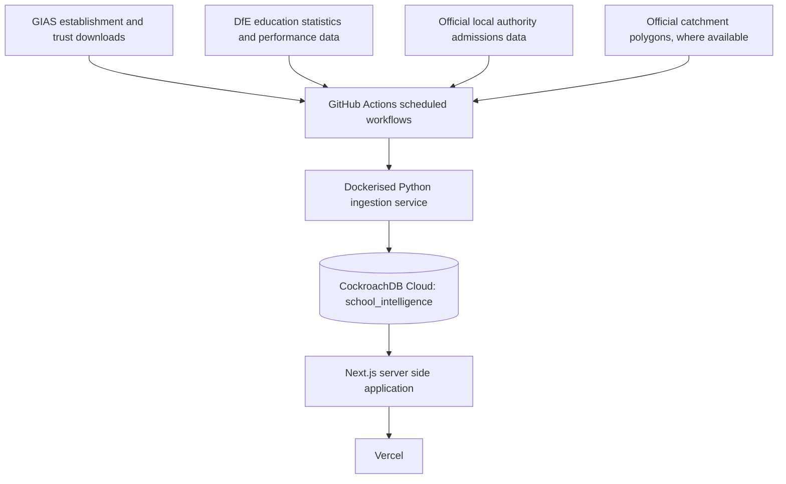

# SchoolScope England

Search, compare, and explore schools, academy trusts, local authorities,
official school statistics, and official school catchment or priority
admission areas in England.

**Live URL:** _pending first production deployment, see docs/deployment.md_

## Purpose

SchoolScope England is a portfolio project demonstrating a production-shaped
full-stack, data-engineering, and GIS build: a scheduled ingestion pipeline
pulling from official UK government sources, a spatial catchment-checking
feature built without a dedicated spatial database extension, and a
Next.js/CockroachDB/Vercel deployment with no dependency on a developer's
own machine staying online.

It is deliberately conservative about what it claims. It does not compute a
"best school" score, does not promise catchment coverage it does not have,
and never tells a parent a school place is guaranteed.

## Screenshots

_Added after the first working deployment; see docs/deployment.md for
status._

## Architecture



Full diagrams (data flow, catchment point-check flow, database ER diagram,
deployment flow) are in `docs/architecture.md` and `docs/database.md`.

## Features

- School search with URN, name, postcode, local authority, phase,
  establishment type, trust, and more, kept in the URL, keyset paginated
- School detail pages showing every field GIAS publishes, plus statistics
  with their definitions, academic years, and suppression status
- Academy trust and local authority explorers, without an opaque composite
  ranking
- An admissions and catchments explorer returning one of a fixed, honest set
  of statuses (never "eligible" or "guaranteed"), backed by real
  point-in-polygon geometry checks against officially published boundaries
- A MapLibre GL map with clustering, viewport-based queries, and an
  accessible list-view alternative
- A methodology page explaining every source, limitation, and why there is
  no overall school score
- A `/status` page reporting data freshness without exposing infrastructure
  detail

## Technology stack

**Web:** Next.js (App Router), React, TypeScript (strict), Tailwind CSS,
shadcn/ui, Recharts, MapLibre GL JS, Turf.js, Prisma (CockroachDB provider),
Zod, Vitest, Playwright, ESLint, Prettier, pnpm.

**Ingestion:** Python 3.12+, Psycopg 3, HTTPX, Pydantic, Typer, Tenacity,
streaming CSV / Polars, Shapely, PyProj, Pytest, Ruff, Mypy, structured JSON
logging, Docker.

**Infrastructure:** GitHub (source control, CI, scheduled and manual
workflows), CockroachDB Cloud (`aqua-roach` cluster, `school_intelligence`
database), Vercel (hosting, preview and production deployments).

## Data sources

See `docs/data-sources.md` for the full, current list with licences. In
summary: DfE's Get Information about Schools (GIAS), the DfE Explore
Education Statistics API, and, for catchment boundaries, a small pilot list
of official local-authority sources starting with Sheffield City Council.

## Admissions disclaimer

Every catchment or admissions result in this application displays:

> This result shows the published priority or catchment area for the
> selected academic year. It does not guarantee that a school place will be
> offered. Check the official admissions policy before applying.

See `docs/admissions-and-catchments.md` for the full policy.

## Catchment coverage

Pilot only, currently Sheffield (DfE local authority code 373). Nationwide
coverage is not claimed. See `config/catchment-sources.yml`.

## Local setup

```bash
pnpm install
cp .env.example .env.local        # apps/web
cp .env.example services/ingestor/.env
docker compose up -d cockroachdb
pnpm db:generate
pnpm db:migrate
pnpm dev                          # apps/web on http://localhost:3000
```

Ingestion locally:

```bash
cd services/ingestor
pip install -e ".[dev]"
ingestor run --dry-run
```

## Cloud setup

See `docs/deployment.md` for the full one-time GitHub, CockroachDB Cloud,
and Vercel setup sequence, and `docs/operations.md` for the CockroachDB
bootstrap procedure.

## Testing

```bash
pnpm lint && pnpm typecheck && pnpm test && pnpm build
pnpm test:e2e

cd services/ingestor
ruff check . && mypy src && pytest
```

See `docs/ingestion.md` and the test suites under `apps/web/tests` and
`services/ingestor/tests` for coverage detail.

## Privacy

No pupil-level data, no stored home addresses, no postcodes in analytics.
See `docs/privacy.md`.

## Free-tier controls

Import starts with a bounded pilot (10,000 representative schools, trust
relationships, selected metrics, Sheffield catchments), with cluster storage
and compute usage measured before and after, and a 30%-margin projection
before any larger import proceeds. See `docs/operations.md`.

## Known limitations

- Catchment coverage is one pilot local authority, not national.
- Historical offer data, where present, is illustrative context only, not a
  predictor.
- No user accounts or saved searches in this MVP.

## Roadmap

- Expand catchment source coverage local authority by local authority.
- Add more EES publications (key stage outcomes, destinations).
- Optional saved-preference feature with explicit consent, if ever added,
  keeping the no-stored-address rule for anonymous use intact.

## License

See `LICENSE`. Underlying government data retains its own licence terms
(commonly the Open Government Licence); see `docs/data-sources.md`.
