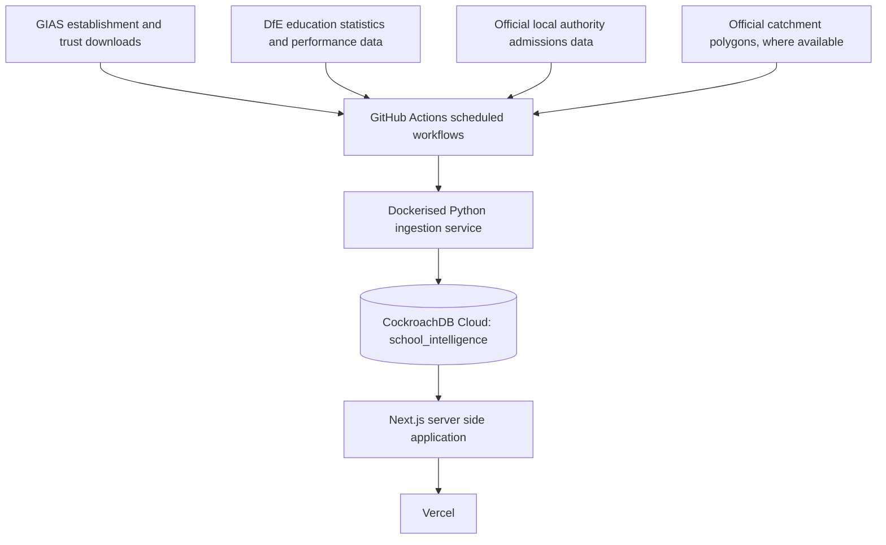
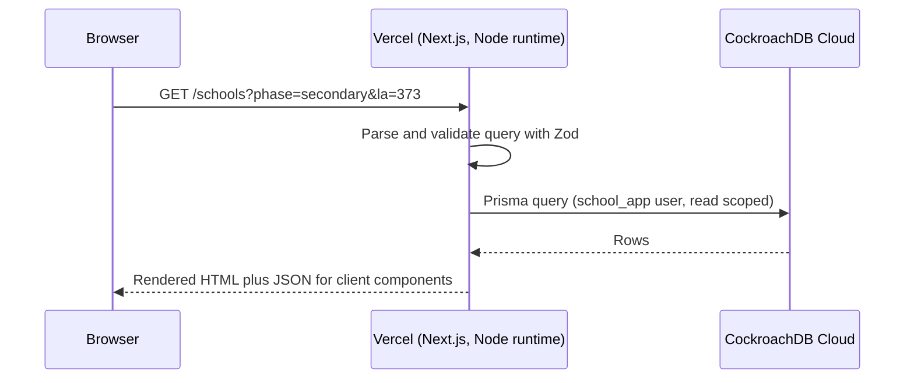
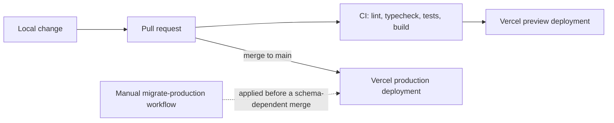

# Architecture

catchment-zone is a monorepo with three deployable pieces and one shared
schema. Nothing about serving the application depends on any machine staying
switched on after deployment: ingestion runs on GitHub Actions, the database
runs on CockroachDB Cloud, and the application runs on Vercel.

## Cloud architecture

## Why this split

- **GitHub Actions** owns anything that has to run on a schedule or be
  triggered manually with an audit trail: ingestion, migrations, CI. GitHub
  secrets hold the two privileged database credentials (`INGEST_DATABASE_URL`,
  `MIGRATION_DATABASE_URL`) that the browser must never see.
- **CockroachDB Cloud** is the single production datastore. The browser never
  talks to it directly; every read goes through a Next.js Node.js runtime
  route handler or server component using the least-privilege `DATABASE_URL`.
- **Vercel** owns the application runtime: server rendering, API routes,
  preview deployments per pull request, and production deployments on merge
  to `main`. Vercel only ever holds the low-privilege application connection
  string, never the migration or ingestion credentials.

## Request flow (typical page load)

## Deployment flow

Schema migrations are never automatic on merge. They are a separate, manually
triggered GitHub Actions workflow so a production schema change on a shared
CockroachDB cluster is always a deliberate act, not a side effect of merging
application code.

## Runtime choice

All database-backed route handlers use the Node.js runtime. The Edge runtime
is not used anywhere in this project: CockroachDB's driver compatibility and
connection-pooling behaviour under Edge has not been verified, and the
product spec explicitly requires verification before using it.
