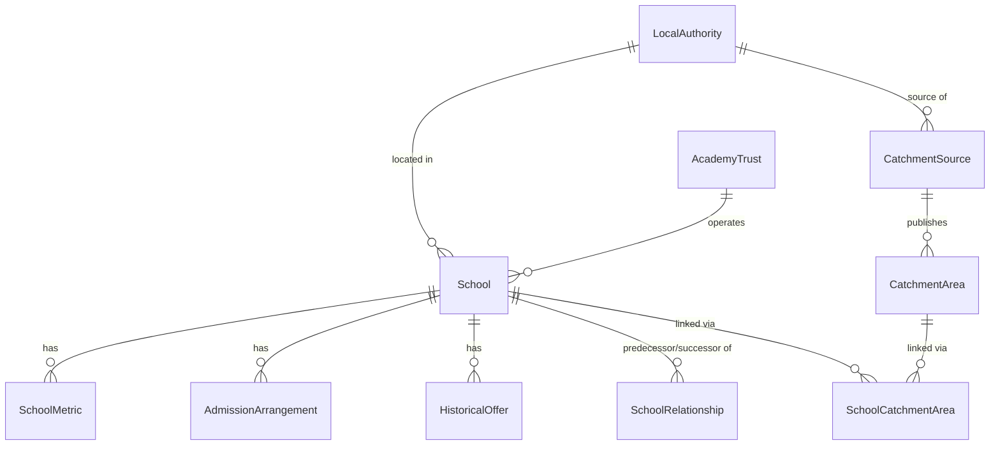

# Database

CockroachDB Cloud is the only production datastore. The schema is defined in
`packages/database/prisma/schema.prisma` with `provider = "cockroachdb"`.

## Entity relationships

`SchoolCatchmentArea` is a join table on purpose: a catchment polygon can
serve more than one school (a shared infant/junior priority area, for
example), and a school can have more than one associated area if its
admission authority applies overlapping criteria.

## Users and privilege boundaries

Three CockroachDB SQL users exist, provisioned by
`scripts/bootstrap-cockroachdb.sh` from an administrative bootstrap
connection that is never stored anywhere in this repository or in chat
history:

| User | Used by | Can | Cannot |
|---|---|---|---|
| `school_migrator` | `migrate-production.yml` workflow, manual only | `CREATE`, `ALTER`, `DROP` on `school_intelligence` schema objects | Nothing else; not used for application traffic |
| `school_ingestor` | Scheduled/manual ingestion workflows | `INSERT`, `UPDATE`, `SELECT`, `DELETE` on data tables | Schema changes, managing SQL users |
| `school_app` | Vercel production and preview deployments | `SELECT`, and the narrow `INSERT`/`UPDATE` needed for `PostcodeCache` | Migrations, bulk import, dropping tables, managing SQL users |

The Vercel-facing `DATABASE_URL` is always the `school_app` credential.

## Geometry strategy

CockroachDB Cloud on the free/starter tier is not assumed to have PostGIS or
a spatial extension available, so geometry is stored as GeoJSON text plus
plain numeric bounding-box columns (`minimum_latitude`, `maximum_latitude`,
`minimum_longitude`, `maximum_longitude`) on `CatchmentArea`. Point-in-polygon
queries work in two stages:

1. A cheap SQL bounding-box prefilter (`minimum_latitude <= y AND
   maximum_latitude >= y AND minimum_longitude <= x AND maximum_longitude >=
   x`) narrows candidates using an index.
2. Precise point-in-polygon testing runs in application code (Turf.js on the
   Next.js server, Shapely in the Python ingestor) against the candidate
   set, never against the full table.

`simplified_geometry_geojson` holds a lower-detail version used at low map
zoom levels; `geometry_geojson` holds the validated, full-detail source
geometry used at high zoom and for the precise point-in-polygon check.

## Indexes

Indexes exist on: `School.normalisedName`, `School.postcode`,
`School.postcodePrefix`, `School.localAuthorityCode`, `School.phaseCode`,
`School.establishmentTypeCode`, `School.status`, `School.trustId`,
`School.(latitude, longitude)`, `SchoolMetric.(metricCode, academicYear)`,
`SchoolMetric.(schoolUrn, academicYear)`, `CatchmentArea.(minimumLatitude,
maximumLatitude, minimumLongitude, maximumLongitude)`,
`CatchmentSource.(localAuthorityCode, academicYear)`. No unsupported
PostgreSQL extension (e.g. trigram) is assumed; prefix search relies on plain
B-tree prefix scans against `postcodePrefix` and `normalisedName`, which is
sufficient at pilot scale. Before adding any further index, run `EXPLAIN` on
the representative query it is meant to help and confirm it changes the plan.

## Retention

* `PostcodeCache` rows expire (`expires_at`) and are pruned by `ingestor
  cleanup`; nothing here is tied to a user identity.
* `CatchmentArea.simplified_geometry_geojson` for a superseded academic year
  is retained only as long as documentation or historical display requires;
  routine cleanup removes simplified display geometry for versions no longer
  shown, while `CatchmentSource` metadata and the full-detail geometry for
  officially required historical years are preserved.
* `IngestionRun` rows for old successful runs are pruned on a rolling window;
  failed-run details are retained longer to support debugging.
